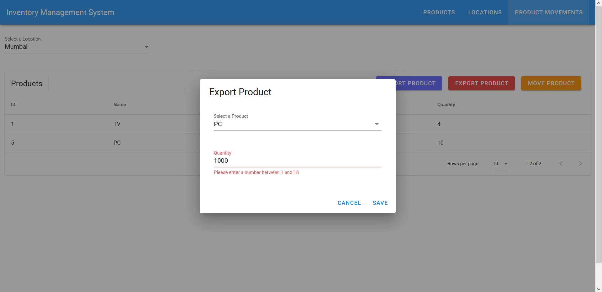

<div align="center">

# FrappeTest

</div>

# Table of Content

- [About](#description)
- [Getting Started](#getting_started)
- [Built With](#built_with)
- [Future Scope](#future_scope)
- [File Structure](#file_structure)
- [Authors](#authors)
- [Screenshots](#screenshots)

## About<a name="description"></a>

- A basic Inventory Management System made using Flask, MySQL and Vue.js
- Displays current list of products, store locations, renders store reports based on product movement logs.

## Getting Started<a name="getting_started"></a>

These instructions will get you a copy of the project up and running on your local machine for development and testing purposes. See deployment for notes on how to deploy the project on a live system.

### Prerequisites

What things you need to install the software and how to install them

Installing NodeJs

```bash
sudo apt-get install nodejs
```

If using a Windows based system, please refer to [Node.js](https://nodejs.org/en/download/) for futher steps.

Installing VueJs

```bash
npm install -g @vue/cli
```

### Installing

A step by step series of examples that tell you how to get a development env running

Cloning the repo

```bash
git clone https://github.com/sephiroth7712/flask-test.git
```

Installing the dependencies - Flask

```bash
cd flask-test
pip3 install -r requirements.txt
```

Running the Flask server

```bash
python3 server.py
```

Installing the dependencies - Vue

```bash
cd flask-test
cd frappetest
npm install
```

Compiles and hot-reloads for development

```bash
npm run serve
```

Compiles and minifies for production

```bash
npm run build
```

Lints and fixes files

```bash
npm run lint
```

Customize configuration
See [Configuration Reference](https://cli.vuejs.org/config/)

The server will now be running on https://localhost:5000/ <br>
If executed in development mode the webapp will now be accessible on https://localhost:8080/

## Built With<a name="built_with"></a>

- [MySQL](https://www.mysql.com/) - Database
- [VueJs](https://vuejs.org/) - Web Framework
- [Flask](https://flask.palletsprojects.com/en/1.1.x/) - Server Environment
- [Vuetify](https://vuetifyjs.com/en/) - Material Components

## Future Scope <a name="future_scope"></a>

- Uploading data using Excel/CSV

## File Structure <a name="file_structure"></a>

/server.py : Main server code <br>
/frappetest : Website code <br>

## Authors<a name="authors"></a>

- [Roshan James](https://github.com/sephiroth7712) <br>

## Screenshots<a name="screenshots"></a>

### Products


### Locations


### Product Movements


### Import Products


### Export Products



### Move Products


